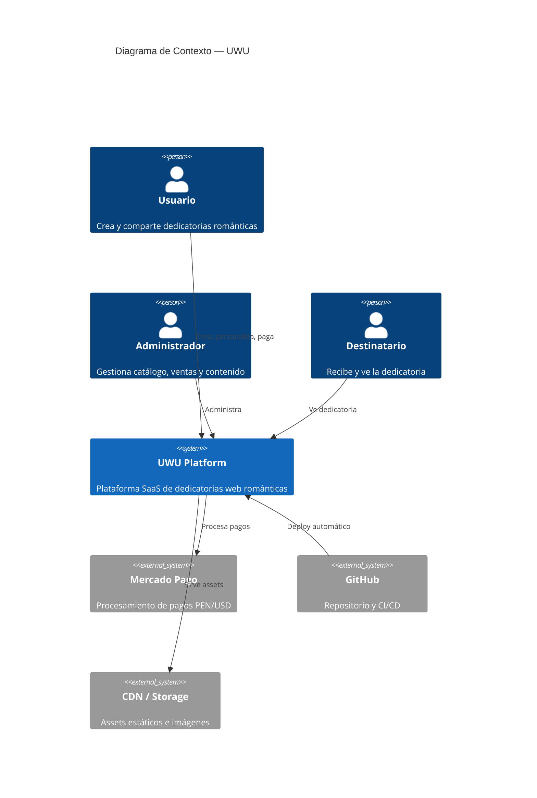
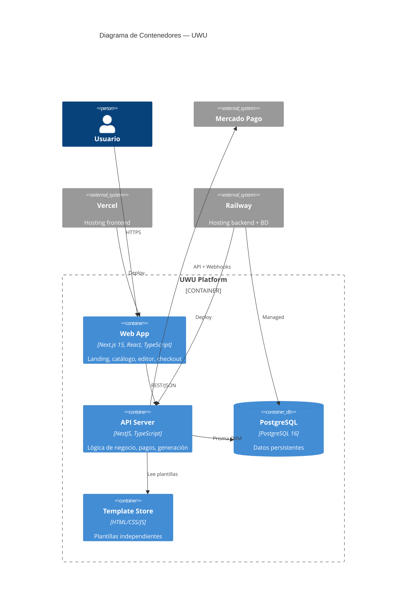
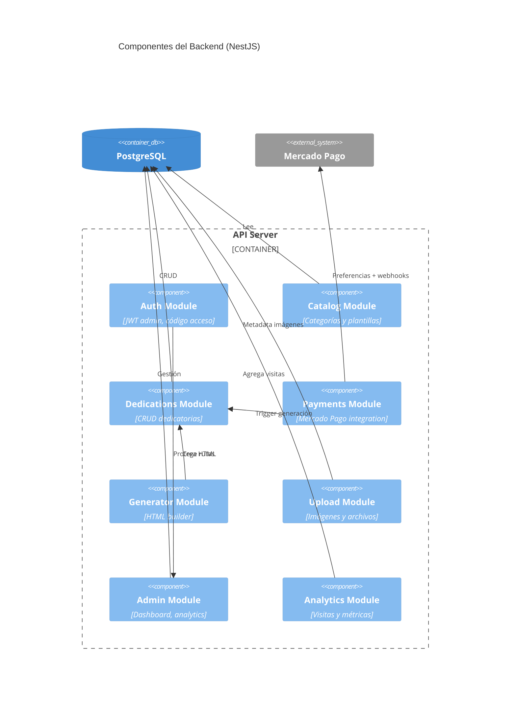
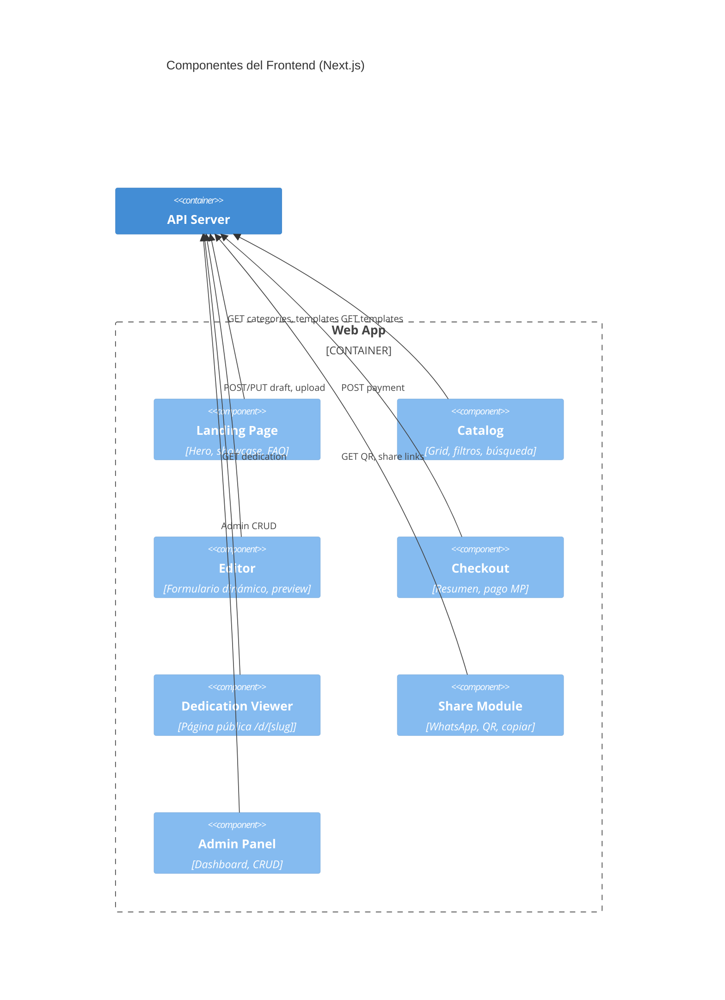

# 🏗️ Arquitectura C4 — UWU

## Nivel 1: Contexto



---

## Nivel 2: Contenedores



---

## Nivel 3: Componentes — API Server



---

## Nivel 3: Componentes — Frontend



---

## Despliegue

```
GitHub (push main)
      │
      ▼
GitHub Actions (CI)
  ├── lint + test + build
  ├── docker build backend
  └── deploy
      ├── Vercel ← frontend/
      └── Railway ← backend/ + PostgreSQL
```
