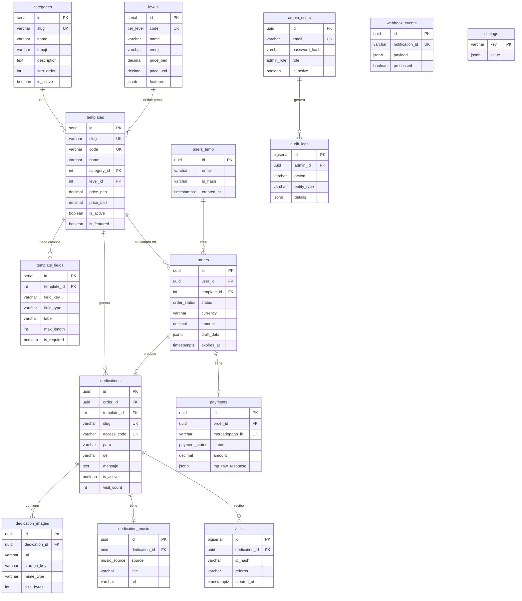

# 🗄️ Diagrama Entidad-Relación (ERD) — UWU



---

## Relaciones clave

| Relación | Cardinalidad | Descripción |
|----------|--------------|-------------|
| categories → templates | 1:N | Una categoría tiene muchas plantillas |
| levels → templates | 1:N | Un nivel define el tier de muchas plantillas |
| templates → template_fields | 1:N | Campos configurables del editor |
| orders → payments | 1:0..1 | Una orden tiene máximo un pago |
| orders → dedications | 1:0..1 | Una orden genera una dedicatoria |
| dedications → dedication_images | 1:N | Hasta 10 imágenes según nivel |
| dedications → visits | 1:N | Analytics de visitas |

---

## Índices críticos

```sql
-- Búsquedas frecuentes
idx_templates_slug          UNIQUE ON templates(slug)
idx_dedications_slug        UNIQUE ON dedications(slug)
idx_dedications_access_code UNIQUE ON dedications(access_code)
idx_payments_mp_id          UNIQUE ON payments(mercadopago_id)
idx_webhook_events_notif    UNIQUE ON webhook_events(notification_id)

-- Filtros y ordenamiento
idx_templates_active        ON templates(is_active, sort_order)
idx_orders_status           ON orders(status)
idx_visits_dedication       ON visits(dedication_id)
idx_visits_created          ON visits(created_at DESC)
idx_audit_logs_created      ON audit_logs(created_at DESC)
```

---

## Normalización

| Forma | Estado |
|-------|--------|
| 1NF | ✅ Sin grupos repetitivos (imágenes en tabla separada) |
| 2NF | ✅ Todos los campos dependen de PK completa |
| 3NF | ✅ Sin dependencias transitivas (precio en levels, override en templates) |

**Denormalización intencional:**
- `templates.visit_count` y `templates.purchase_count` — contadores cacheados, actualizados por triggers/cron
- `dedications.visit_count` — evita COUNT(*) en cada request
