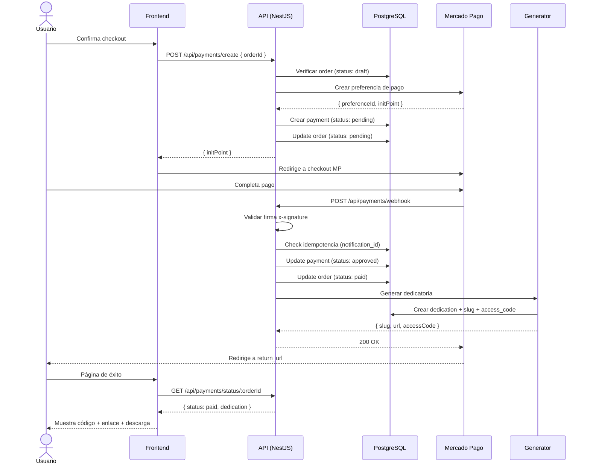
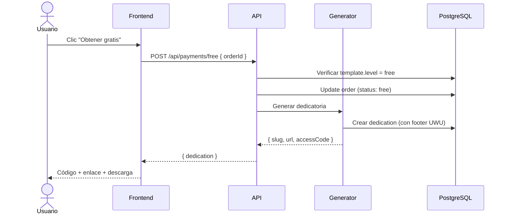

# 💳 Flujo de Pagos — UWU

## Diagrama de secuencia



---

## Flujo gratis (sin Mercado Pago)



---

## Estados de pago

| Estado MP | Estado interno | Acción |
|-----------|----------------|--------|
| `pending` | `pending` | Esperar webhook |
| `approved` | `approved` | Generar dedicatoria |
| `rejected` | `rejected` | Permitir reintento |
| `cancelled` | `cancelled` | Cerrar orden |
| `refunded` | `refunded` | Desactivar dedicatoria |

---

## Manejo de errores

### Webhook duplicado
```
1. Buscar notification_id en webhook_events
2. Si existe → responder 200, no procesar
3. Si no existe → procesar y guardar
```

### Pago aprobado pero generación falla
```
1. Payment queda en approved
2. Order queda en paid
3. dedication = null
4. Cron job reintenta generación cada 5 min (max 3 intentos)
5. Si falla 3 veces → alerta admin + log crítico
```

### Usuario cierra ventana de MP
```
1. Order queda en pending
2. Cron: pending > 1h → expired
3. Usuario puede crear nueva orden desde editor
```

---

## Configuración Mercado Pago

### Variables de entorno

```env
MERCADOPAGO_ACCESS_TOKEN=APP_USR-xxx
MERCADOPAGO_WEBHOOK_SECRET=xxx
MERCADOPAGO_PUBLIC_KEY=APP_USR-xxx
```

### Preferencia de pago

```json
{
  "items": [{
    "title": "UWU — Hello Kitty Mágica",
    "quantity": 1,
    "unit_price": 8.00,
    "currency_id": "PEN"
  }],
  "back_urls": {
    "success": "https://uwu.app/checkout/success?order={orderId}",
    "failure": "https://uwu.app/checkout/failure?order={orderId}",
    "pending": "https://uwu.app/checkout/pending?order={orderId}"
  },
  "notification_url": "https://api.uwu.app/api/payments/webhook",
  "external_reference": "{orderId}",
  "auto_return": "approved"
}
```

---

## Seguridad del webhook

```typescript
// Validación de firma Mercado Pago
function validateWebhookSignature(
  xSignature: string,
  xRequestId: string,
  dataId: string,
  secret: string
): boolean {
  const parts = xSignature.split(',');
  const ts = parts.find(p => p.startsWith('ts='))?.split('=')[1];
  const hash = parts.find(p => p.startsWith('v1='))?.split('=')[1];
  const manifest = `id:${dataId};request-id:${xRequestId};ts:${ts};`;
  const computed = crypto.createHmac('sha256', secret).update(manifest).digest('hex');
  return computed === hash;
}
```
