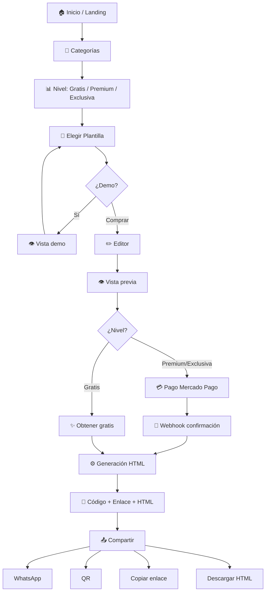
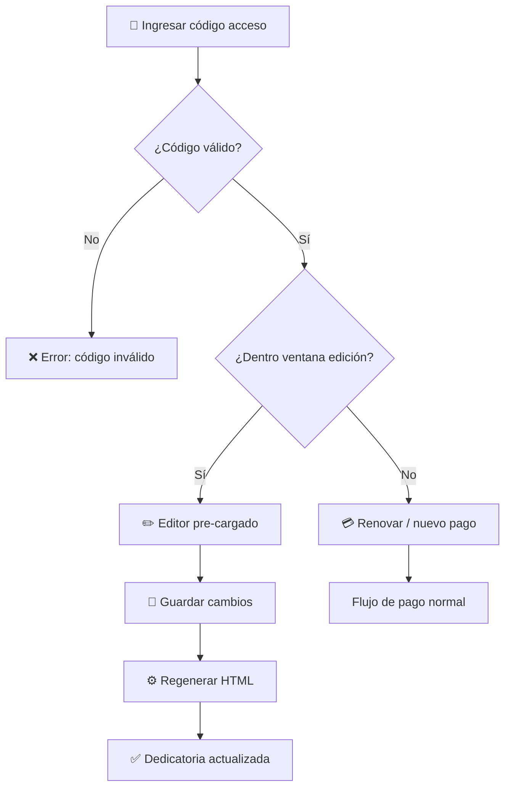
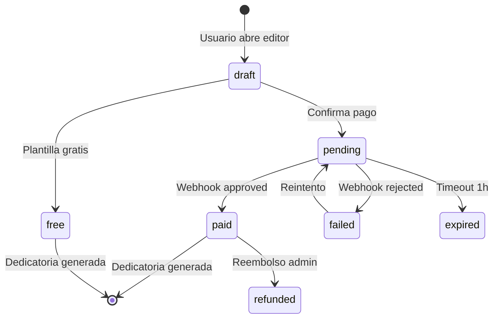

# 🗺️ Flujo de Usuario — UWU

## Flujo principal



---

## Flujo de edición posterior



---

## Flujo del administrador

```mermaid
flowchart TD
    A[/admin/login] --> B{¿Credenciales?}
    B -->|No| A
    B -->|Sí| C[📊 Dashboard]
    C --> D[🎨 Plantillas]
    C --> E[📂 Categorías]
    C --> F[💰 Ventas]
    C --> G[💝 Dedicatorias]
    C --> H[👥 Usuarios admin]
    C --> I[📈 Analytics]
    C --> J[🔍 SEO]
    C --> K[📋 Logs]
    D --> L[Crear / Editar / Activar / Eliminar]
    E --> M[CRUD categorías]
    F --> N[Ver órdenes / Reembolsos]
```

---

## Estados de una orden



---

## Comparación MVP actual vs objetivo

| Paso | MVP (hoy) | Objetivo (v1.0) |
|------|-----------|-----------------|
| Inicio | `index.html` | Next.js `/` |
| Catálogo | Grid en landing | `/catalogo/[cat]` |
| Nivel | Badge visual (tier) | Filtro por nivel |
| Plantilla | Click → checkout modal | `/editor/[slug]` |
| Editor | Form en modal | Página completa |
| Vista previa | Demo en nueva pestaña | iframe live |
| Pago | Simulado (localStorage) | Mercado Pago |
| Webhook | No existe | NestJS handler |
| Generación | JS client-side | Backend generator |
| Compartir | Enlace + descarga HTML | WhatsApp, QR, redes |
