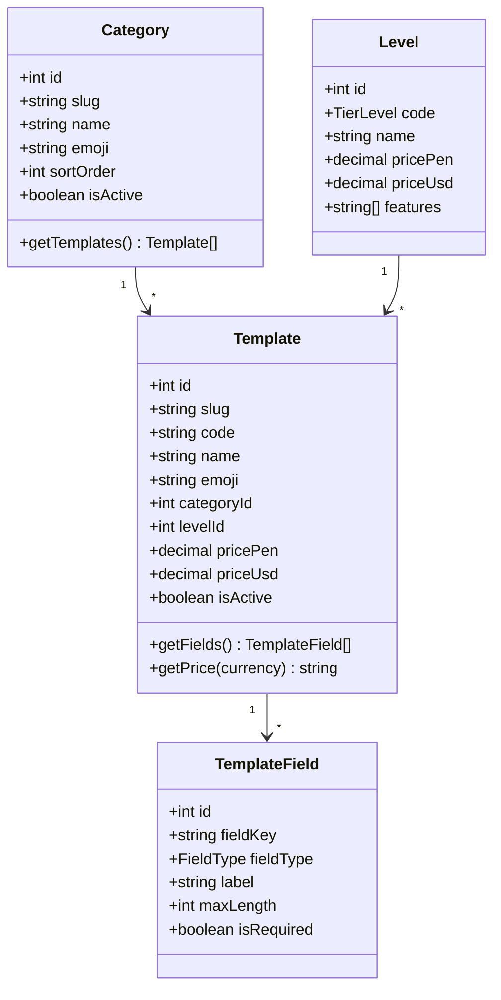
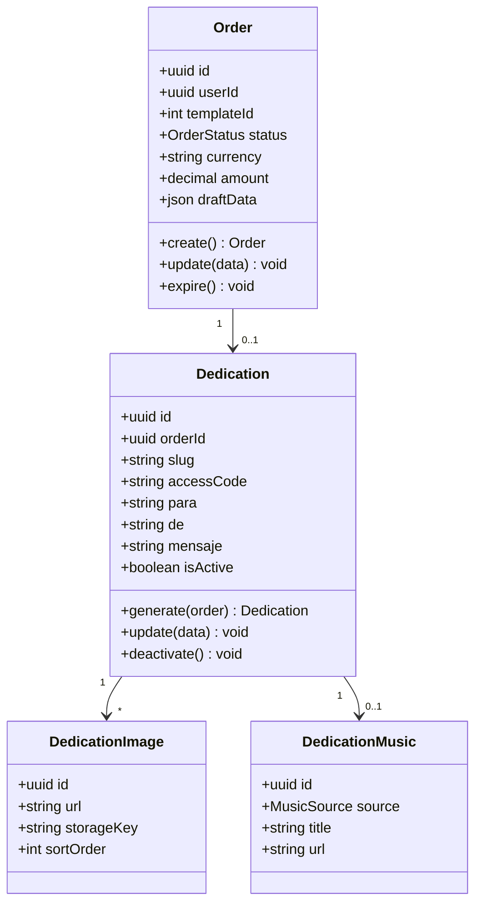
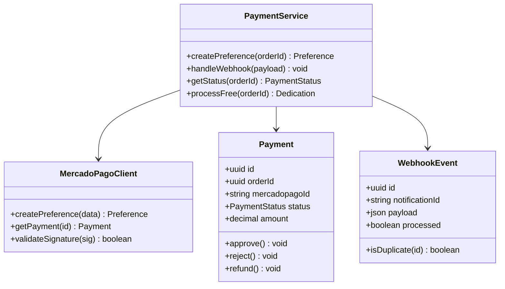
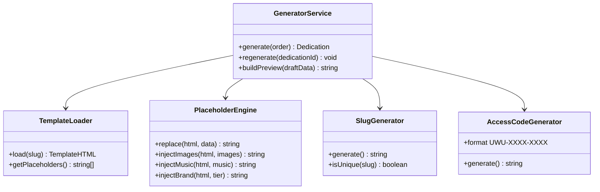
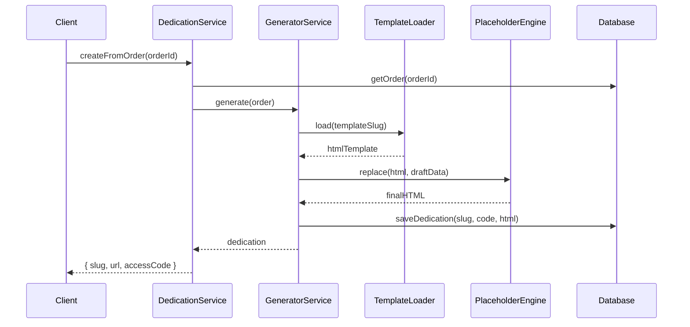
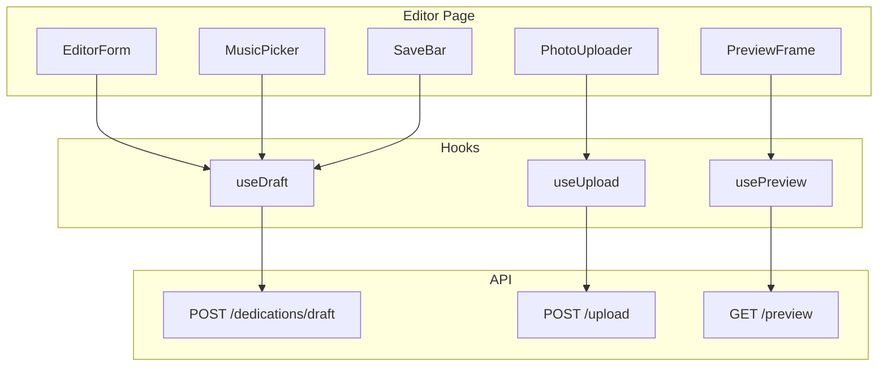

# 🧩 Diagramas UML — Módulos UWU

## Diagrama de clases — Módulo Catálogo

---

## Diagrama de clases — Módulo Dedicatorias

---

## Diagrama de clases — Módulo Pagos

---

## Diagrama de clases — Generador HTML

---

## Diagrama de secuencia — Crear dedicatoria

---

## Diagrama de componentes — Editor

